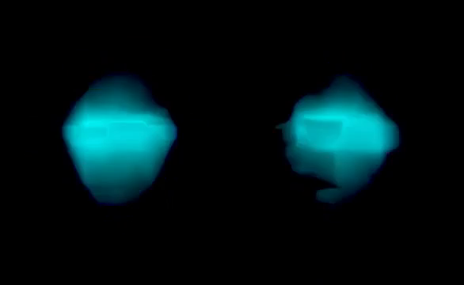
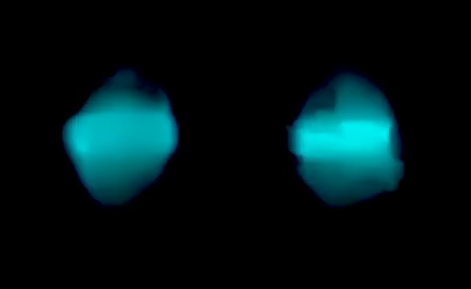
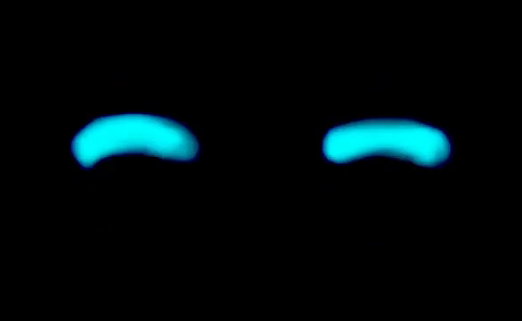
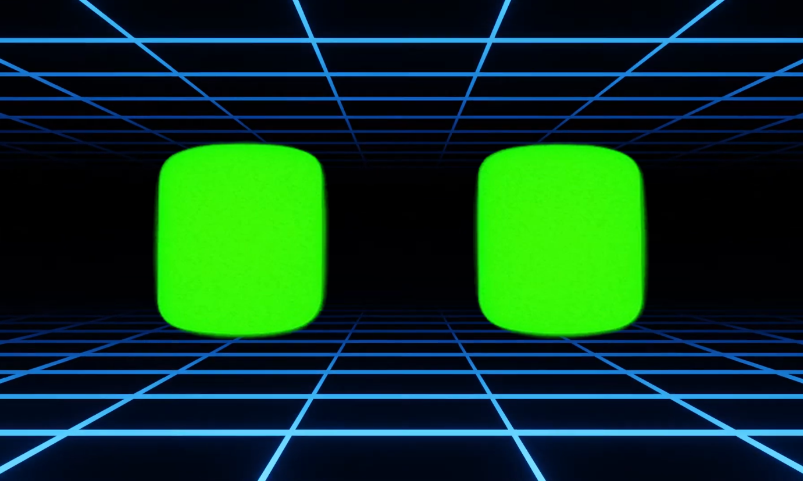

# Galería de Imágenes

Terminal (última generación): sombrilla

Cada celda muestra el código hexadecimal y su miniatura desde images/.

<table>
<tr><td align="center" style="font-size: 20px; padding:4px; font-family:monospace;">01 </td><td align="center" style="font-size: 20px; padding:4px; font-family:monospace;">02 </td><td align="center" style="font-size: 20px; padding:4px; font-family:monospace;">03 </td><td align="center" style="font-size: 20px; padding:4px; font-family:monospace;">04 </td><td align="center" style="font-size: 20px; padding:4px; font-family:monospace;">05 </td></tr>
<tr><td align="center" style="font-size: 20px; padding:4px; font-family:monospace;">06 </td><td align="center" style="font-size: 20px; padding:4px; font-family:monospace;">07 </td><td align="center" style="font-size: 20px; padding:4px; font-family:monospace;">08 </td><td align="center" style="font-size: 20px; padding:4px; font-family:monospace;">E9 </td><td align="center" style="font-size: 20px; padding:4px; font-family:monospace;">EA </td></tr>
<tr><td align="center" style="font-size: 20px; padding:4px; font-family:monospace;">EB </td><td align="center" style="font-size: 20px; padding:4px; font-family:monospace;">EC </td><td align="center" style="font-size: 20px; padding:4px; font-family:monospace;">ED </td><td align="center" style="font-size: 20px; padding:4px; font-family:monospace;">EE </td><td align="center" style="font-size: 20px; padding:4px; font-family:monospace;">EF </td></tr>
<tr><td align="center" style="font-size: 20px; padding:4px; font-family:monospace;">F0 </td><td align="center" style="font-size: 20px; padding:4px; font-family:monospace;">F1 </td><td align="center" style="font-size: 20px; padding:4px; font-family:monospace;">F2 </td><td align="center" style="font-size: 20px; padding:4px; font-family:monospace;">F3 </td><td align="center" style="font-size: 20px; padding:4px; font-family:monospace;">F4 </td></tr>
<tr><td align="center" style="font-size: 20px; padding:4px; font-family:monospace;">F5 </td><td align="center" style="font-size: 20px; padding:4px; font-family:monospace;">F6 </td><td align="center" style="font-size: 20px; padding:4px; font-family:monospace;">F7 </td><td align="center" style="font-size: 20px; padding:4px; font-family:monospace;">F8 </td><td align="center" style="font-size: 20px; padding:4px; font-family:monospace;">F9 </td></tr>
<tr><td align="center" style="font-size: 20px; padding:4px; font-family:monospace;">FA </td><td align="center" style="font-size: 20px; padding:4px; font-family:monospace;">FB </td><td align="center" style="font-size: 20px; padding:4px; font-family:monospace;">FC </td><td align="center" style="font-size: 20px; padding:4px; font-family:monospace;">FD </td><td align="center" style="font-size: 20px; padding:4px; font-family:monospace;">FE </td></tr>
<tr><td align="center" style="font-size: 20px; padding:4px; font-family:monospace;">FF </td><td></td><td></td><td></td><td></td></tr>
</table>

Generado automáticamente por genera.py