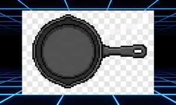
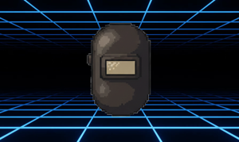

# Carpeta 001

Tipo: IMAGENES

_Nota:_ Etiquetas mostradas en HEX (00=0 decimal, FF=255).

<table>

<tr><td align='center' style='font-family:monospace;font-size:14px'>0101 </td><td align='center' style='font-family:monospace;font-size:14px'>0102 </td><td align='center' style='font-family:monospace;font-size:14px'>0103 </td><td align='center' style='font-family:monospace;font-size:14px'>0104 </td><td align='center' style='font-family:monospace;font-size:14px'>0105 </td></tr>

<tr><td align='center' style='font-family:monospace;font-size:14px'>0106 </td><td align='center' style='font-family:monospace;font-size:14px'>0107 </td><td align='center' style='font-family:monospace;font-size:14px'>0108 </td><td align='center' style='font-family:monospace;font-size:14px'>0109 </td><td align='center' style='font-family:monospace;font-size:14px'>010A </td></tr>

<tr><td align='center' style='font-family:monospace;font-size:14px'>010B </td><td align='center' style='font-family:monospace;font-size:14px'>010C </td><td align='center' style='font-family:monospace;font-size:14px'>010D </td><td align='center' style='font-family:monospace;font-size:14px'>010E </td><td align='center' style='font-family:monospace;font-size:14px'>010F </td></tr>

<tr><td align='center' style='font-family:monospace;font-size:14px'>0110 </td><td></td><td></td><td></td><td></td></tr>

</table>